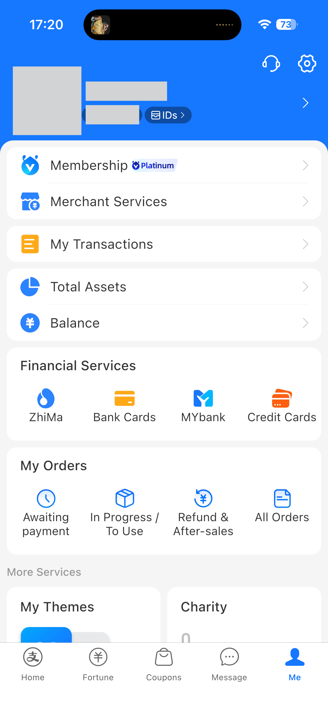
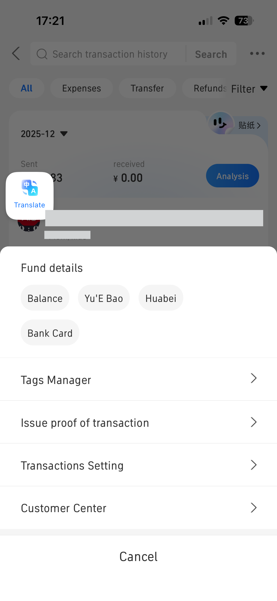
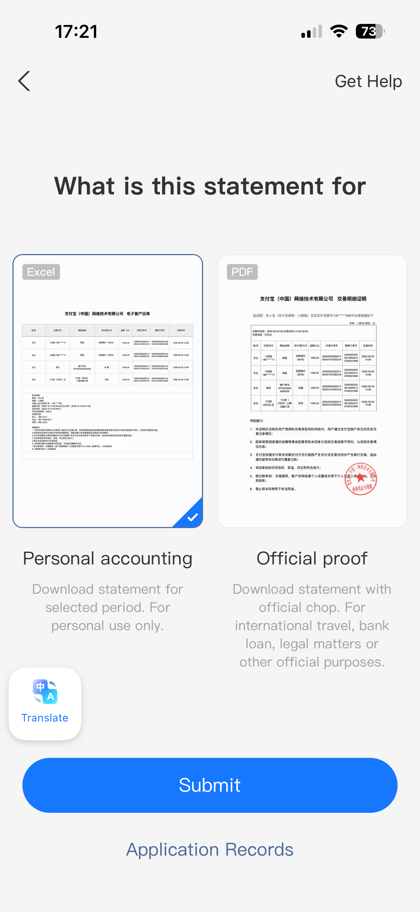
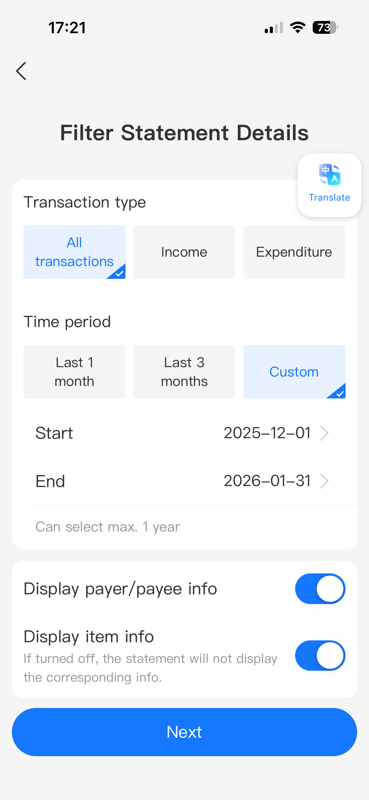
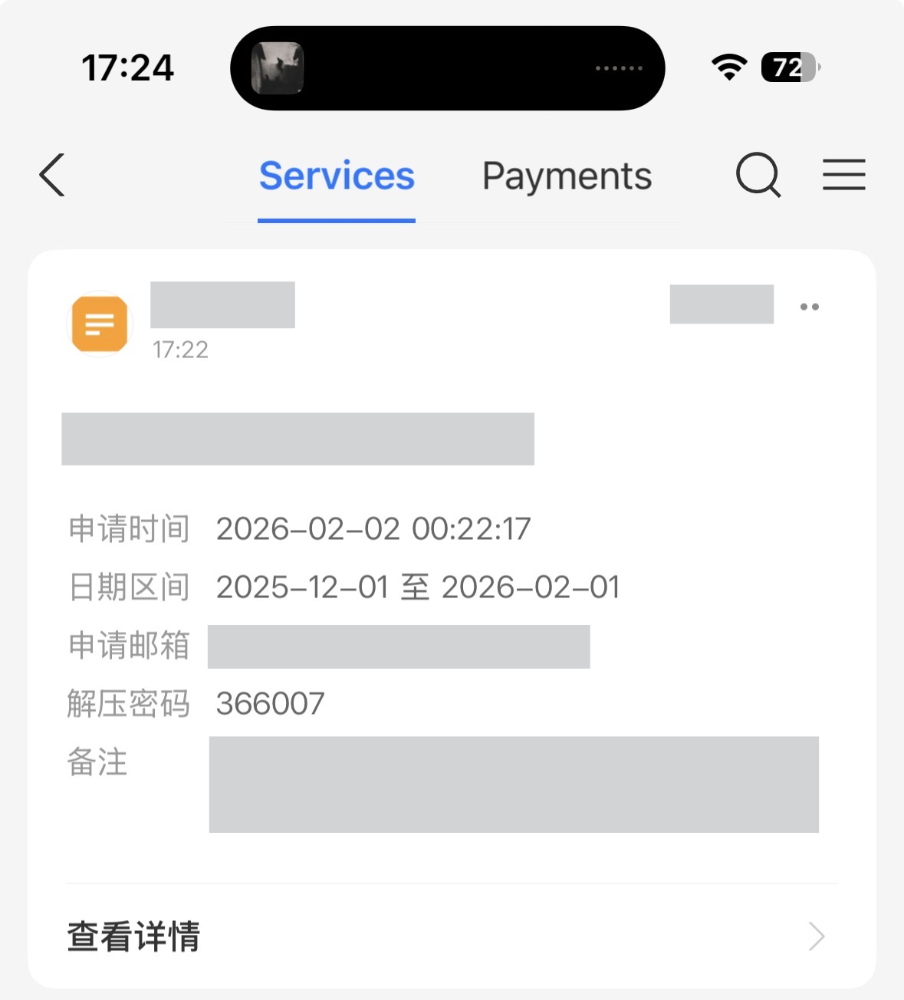

# How to make a statement

Updated by: Silvio Da Col
Last update: February 2026

1. In the app on the phone, go to **Me** to access your profile.
2. Select **My Transactions**.

3. Click on the top-right 3-dots menu and select **Issue proof of transaction**.

4. Select **Personal accounting**.

5. Select the options you want and click on **Next**.

6. When the statement will arrive by email, wait for a message with the code to unzip the report.

Note: If you see changes in the statement format, please open an issue or a pull request to update this parser.
