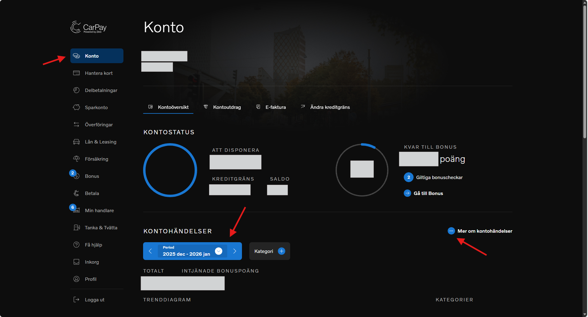
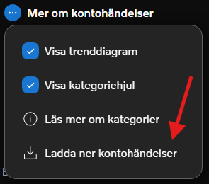

# How to make a statement

Updated by: Silvio Da Col
Last update: February 2026

1. Access the Carpay website at https://www.carpay.se/ and log in to your account.
2. Navigate to the **Konto** (Account) section from the menu on the left side.
3. In **Kontohandelser** (Account Transactions), select the date range for the statement you want to download.
4. Click on **Mer om Kontohandelser** (More about Account Transactions) to expand additional options.

5. Click on **Ladda ner Kontohandelser** (Download Account Transactions) to download the statement in Excel format.

Note: If you see changes in the statement format, please open an issue or a pull request to update this parser.
