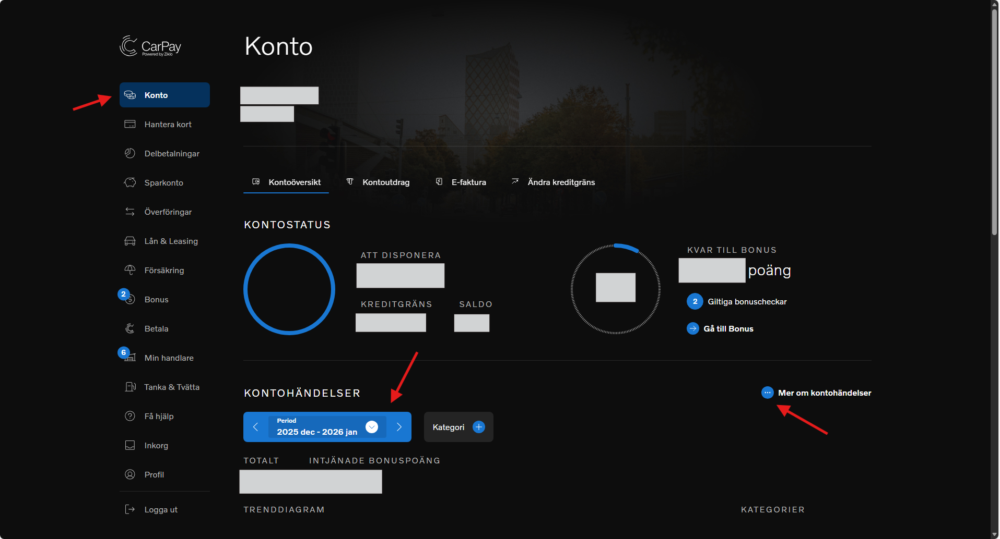
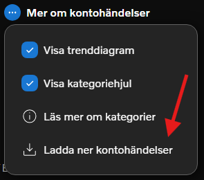

# How to make a statement

Updated by: Silvio Da Col
Last update: February 2026

1. Access the Carpay website at https://www.carpay.se/ and log in to your account.
2. Navigate to the **Konto** (Account) section from the menu on the left side.
3. In **Kontohandelser** (Account Transactions), select the date range for the statement you want to download.
4. Click on **Mer om Kontohandelser** (More about Account Transactions) to expand additional options.

5. Click on **Ladda ner Kontohandelser** (Download Account Transactions) to download the statement in Excel format.

Note: If you see changes in the statement format, please open an issue or a pull request to update this parser.

## Parser Notes (for contributors)

- `src/main.rs`: CLI entrypoint using the shared `utils::ParserContract` pipeline.
- `src/lib.rs`: parser facade + merge helpers exposed by the crate.
- `src/accounts.rs`: maps CarPay account metadata to normalized accounts.
- `src/transactions.rs`: parses workbook rows into normalized transactions.
- `src/instruments.rs`: placeholder hooks for future investment instrument parsing.
- `src/positions.rs`: placeholder hooks for future investment position parsing.

- This parser currently focuses on card cashflows (`accounts` + `transactions`).
- Pipeline behavior is profile-driven via `utils::PipelineProfile::StricterForDedup` in the CLI entrypoint.

- Carpay is a credit card and the statements do not specify when a bank transfer repays it.
