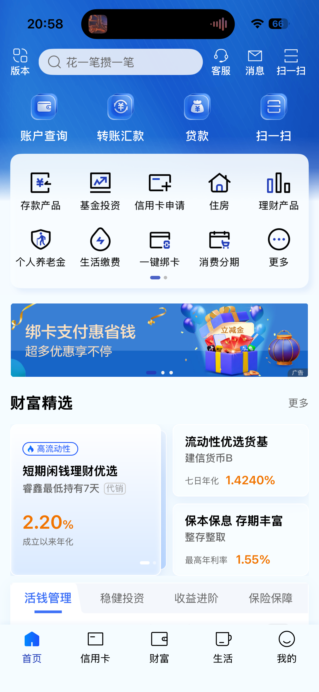
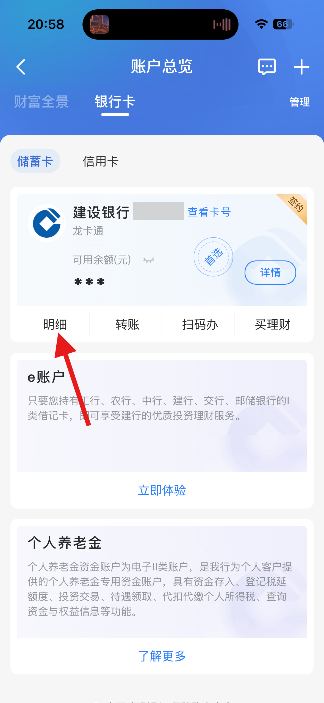
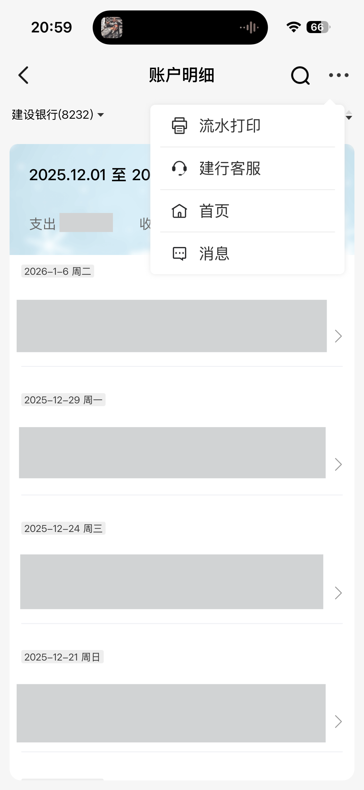
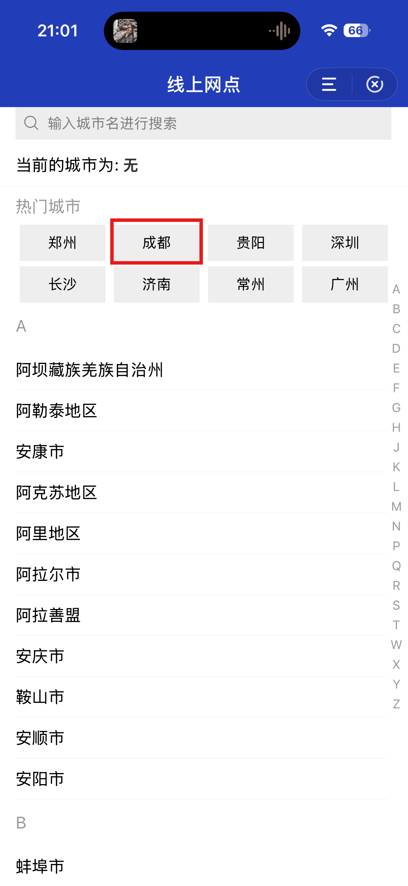
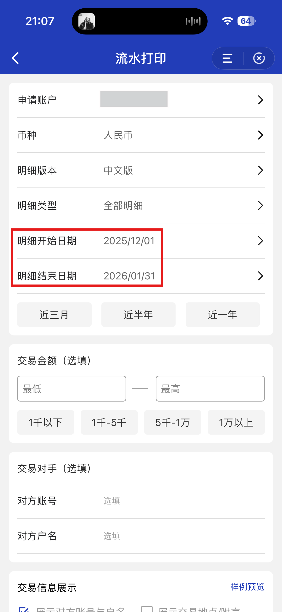
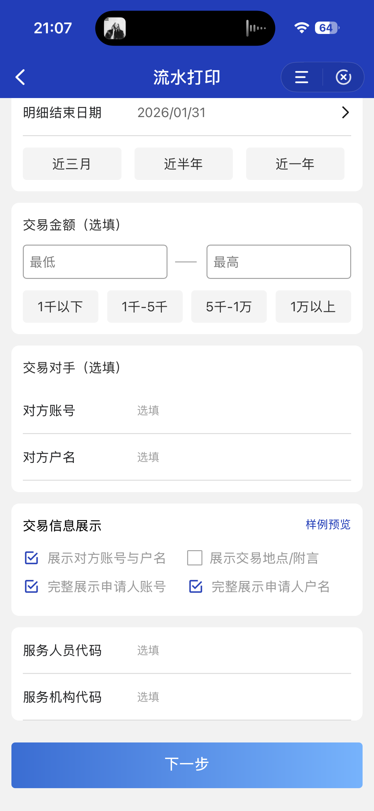
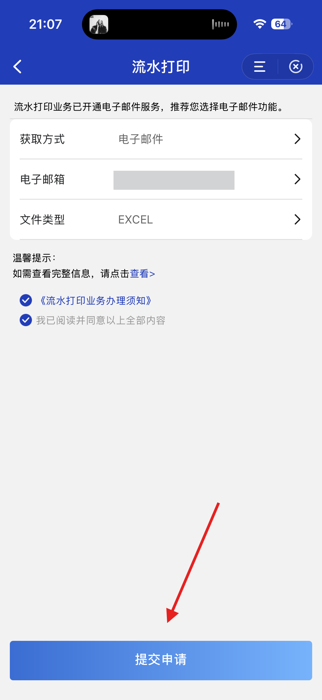

# How to make a statement

Updated by: Silvio Da Col
Last update: February 2026

1. Follow the arrow and click on the button:

2. Follow the arrow and click on the button:

3. Click on the 3-dots menu and select the small printing machine icon:

4. Select the city where you opened the account (in my case it is Chengdu):

5. Follow the arrow and click on the button:

6. Select the range of dates you want to download and click on the button at the bottom:

7. Select the format "EXCEL" and click on the button at the bottom:

8. Store the code to then be able to unzip the file when you will receive by email:

Note: If you see changes in the statement format, please open an issue or a pull request to update this parser.
