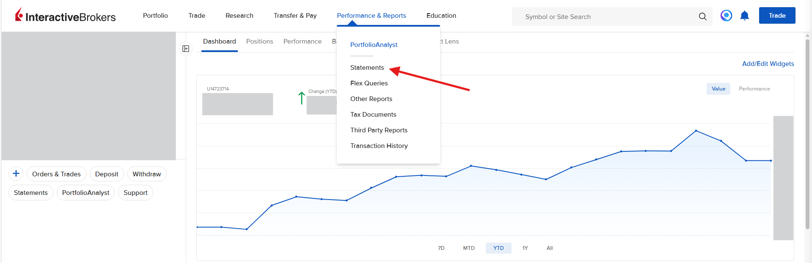
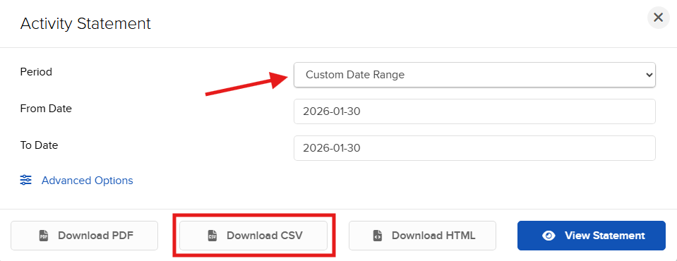

# How to make a statement

Updated by: Silvio Da Col
Last update: February 2026

1. Log in to your Interactive Brokers account via https://www.interactivebrokers.com.
2. From the main page click on **Performance & Reports** -> **Statements**.

3. Select Custom Date Range and set the desired dates.
4. Select **CSV** as the file format.

Note: If you see changes in the statement format, please open an issue or a pull request to update this parser.
