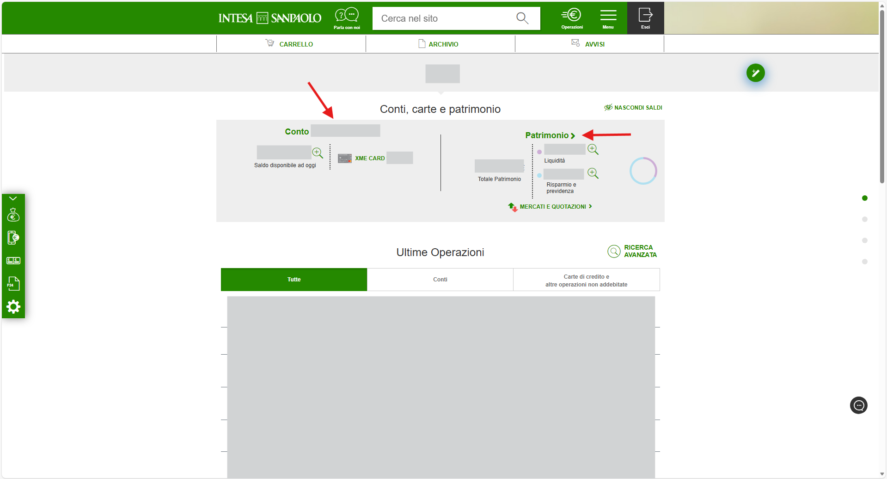
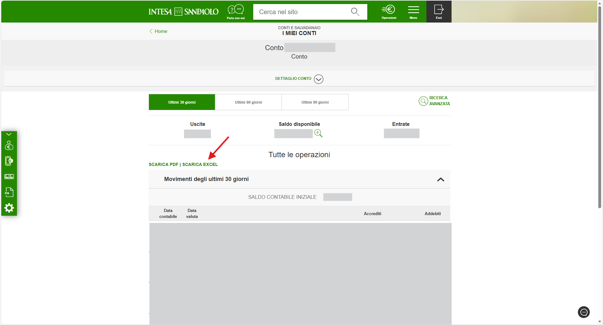
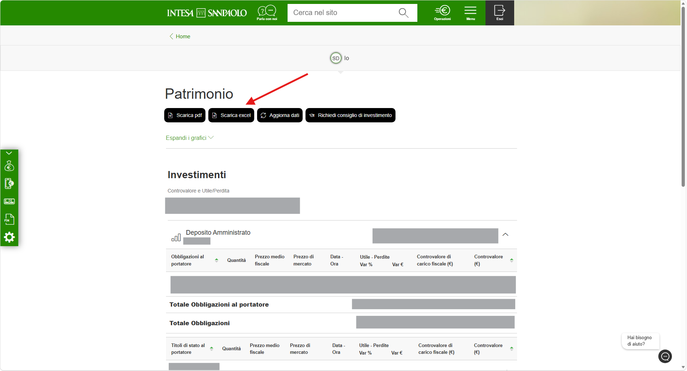

# How to make a statement

Updated by: Silvio Da Col
Last update: February 2026

1. Access your Intesa Sanpaolo online banking account via the web at https://www.intesasanpaolo.com/
2. Click either on your **Conto** (Account) or on your **Patrimonio** (Worth) from the main dashboard.

3. If in the "Conto", select the range of time you want the statement for.
4. Select the **Scarica Excel** button (Download Excel).

5. If in the "Patrimonio", simply click the **Scarica Excel** button (Download Excel).

Note: If you see changes in the statement format, please open an issue or a pull request to update this parser.
