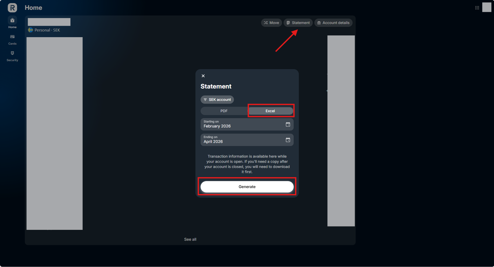

# How to make a statement

Updated by: Silvio Da Col
Last update: February 2026

1. Access your account on the browser via https://www.revolut.com.
2. Click on your profile icon at the top-right corner.
3. Select **Account Statements**.
4. Select **Excel**.
5. Select **Generate**.

Note: If you see changes in the statement format, please open an issue or a pull request to update this parser.
