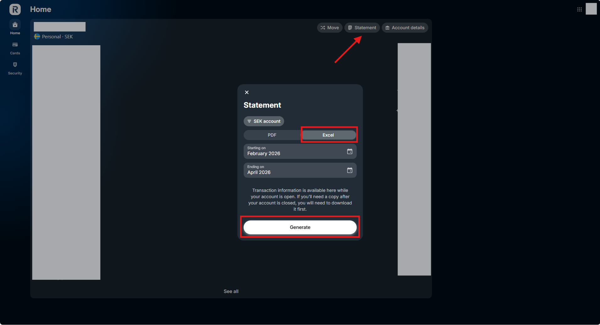

# How to make a statement

Updated by: Silvio Da Col
Last update: May 2026

1. Access your account on the browser via https://www.revolut.com.
2. Select **Statement**.
3. Select **Excel**.
4. Select **Generate**.

Note: If you see changes in the statement format, please open an issue or a pull request to update this parser.

## Parser Notes (for contributors)

### Source Modules (very short)

- `src/main.rs`: CLI entrypoint using the shared `utils::ParserContract` pipeline.
- `src/lib.rs`: parser facade + merge helpers exposed by the crate.
- `src/accounts.rs`: maps Revolut account variants to normalized accounts.
- `src/transactions.rs`: parses CSV rows into normalized transactions.
- `src/instruments.rs`: placeholder hooks for future investment instrument parsing.
- `src/positions.rs`: placeholder hooks for future investment position parsing.

- This parser currently focuses on bank-account style flows (`accounts` + `transactions`).
- The `instruments` and `positions` parser modules are intentionally present as extension points for users that also use Revolut for investments.
- Pipeline behavior is profile-driven via `utils::PipelineProfile::Default` in the CLI entrypoint.
