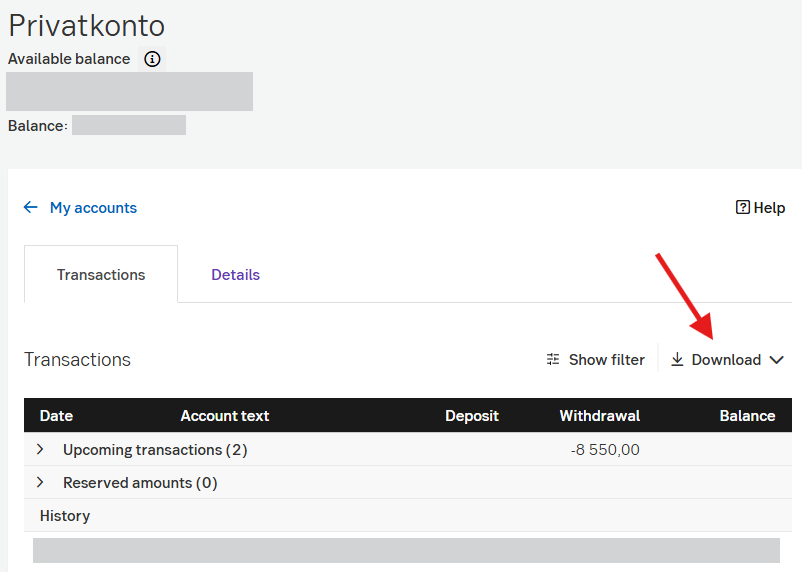

# How to make a statement

Updated by: Silvio Da Col
Last update: February 2026

1. Access the account you want the statement for.
2. Filter the time period you want the statement for.
3. Export the statement in Excel format.

Note: If you see changes in the statement format, please open an issue or a pull request to update this parser.
