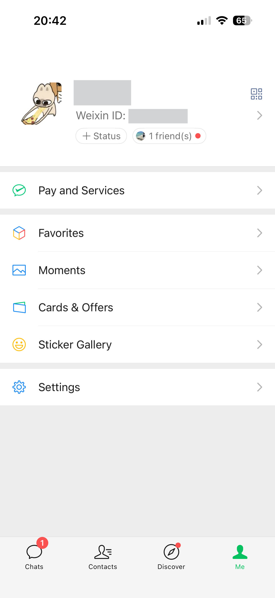
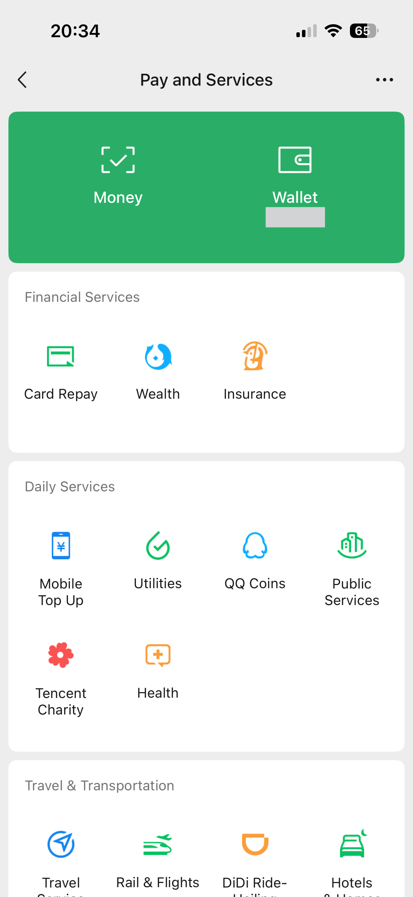
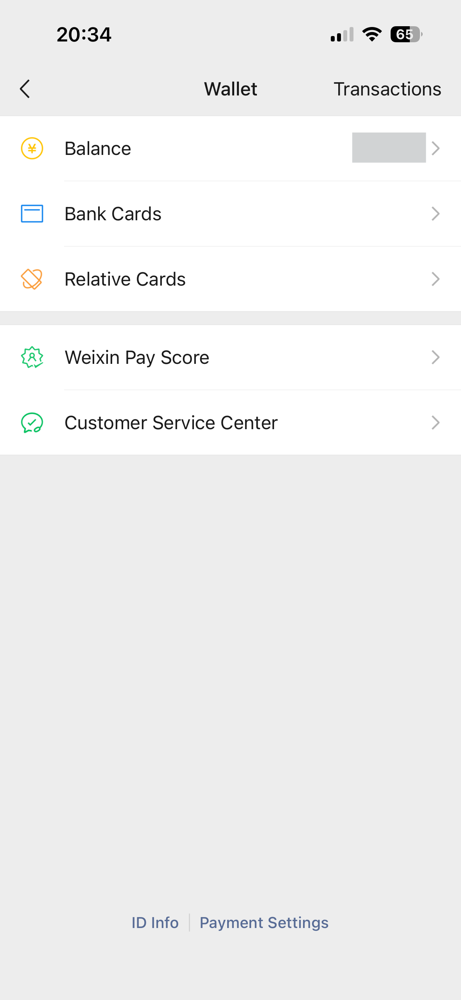
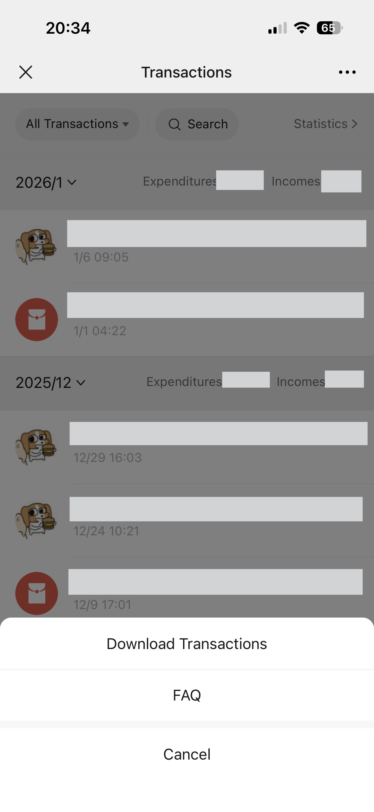
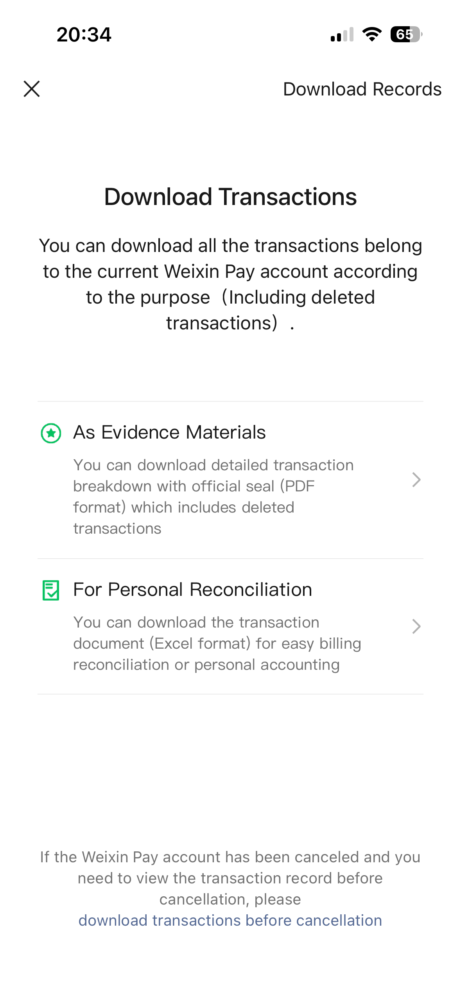

# How to make a statement

Updated by: Silvio Da Col
Last update: February 2026

1. In the app on the phone, go to **Me** to access your profile.
2. Select **Pay and Services**.

3. Click on **Wallet**.

4. Click on **Transactions**.

5. Click on the 3-dots menu and select **Download Transactions**.

6. Select **For Personal Reconciliation** and follow the instructions.

7. When the statement will arrive by email, wait for a message with the code to unzip the report in the "Weixin Pay" chat.

Note: If you see changes in the statement format, please open an issue or a pull request to update this parser.
